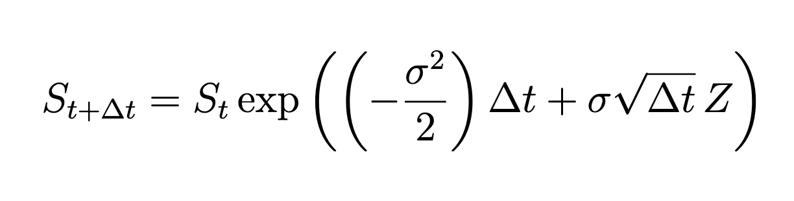
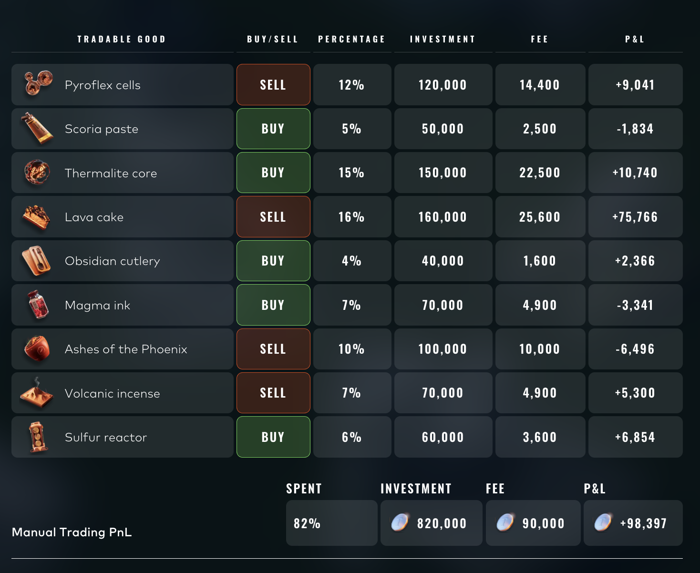

# IMC Prosperity 4: A Top-3% Retrospective

**Result:** 544 / 18,000+ globally · 143 in the US (top 3%)

**Team:** Bhavya Kansal · Shridhar Mehendale · Armaan Sharma , Anshul Mistry

---

## Why this writeup exists

Three weeks of IMC Prosperity 4 taught me more about market microstructure, game theory, and decision-making under uncertainty than any class I've taken. I'm writing this up to consolidate the lessons for myself, help future Prosperity teams who might be starting from where I was three weeks ago, and share the journey with anyone curious about quant trading.

This is mostly about **how we thought** about each problem, not just the final code. The judgment matters more than the implementation — and most of the writeups I found online focused on the latter.

---

## The competition in two paragraphs

IMC Prosperity is an annual algorithmic trading competition run by IMC Trading. Over five rounds and roughly three weeks, ~18,000 teams design Python trading algorithms that compete in a simulated market environment. Each round introduces new products and mechanics: market making, statistical arbitrage, options pricing, exotic derivatives, and news-driven trading. Each round also features a manual challenge — typically a one-shot decision involving optimization, game theory, or interpreting unstructured information.

We finished with a **cumulative algorithmic profit of ~336,745 XIRECs** across Rounds 1–4, before a Round 5 stumble that I'll get into honestly below. Manual rounds added more on top. Our best round was Round 3 (options); our worst was Round 5 (50 products, regime change between backtest and live).

---

## Round 1: Market Making and the First Real Insight

**Profit: +83,953 XIRECs**

**Products:** ASH_COATED_OSMIUM (mean-reverting around 10,000), INTARIAN_PEPPER_ROOT (deterministic upward drift of +0.001/timestamp).

**Key insight:** The two products required entirely different strategies, and figuring out *which is which* was 80% of the work. ASH was textbook mean-reversion — wide 16-tick spread, autocorrelation of -0.49, true price anchored at 10,000. PEPPER was secretly trending — a tiny drift of 0.001 per timestamp that compounded to ~1,000 XIRECs per day if you held the position limit.

**What we built:**
- **ASH:** Passive market-making with a take/clear/make framework. Slow EWMA (alpha=0.002) tracking fair value, aggressive orders capturing any mispricing > 1 tick from fair, passive quotes at the book edge. Inventory controlled with a soft limit at half the position cap and convex sizing.
- **PEPPER:** Drift-following buy-and-hold. Modeled fair value as `intercept + 0.001 × timestamp`. Aggressive accumulation in the first 15,000 timestamps (bid at fair+3 to fill faster), then ride the drift. Added a rolling-peak dip detector that triggered take-profit sells on genuine drops while ignoring normal noise.

**What anyone could have figured out:** Plot the prices. Compute autocorrelation. ASH bounces; PEPPER drifts. The hard part wasn't seeing the patterns — it was committing capital to the trending one. Most teams default to "neutral market-making" because it feels safer, but it leaves PEPPER's deterministic alpha on the table.

The strategy went through three iterations before landing on the final version. Our first attempt was a generic z-score mean-reversion that ignored PEPPER's drift entirely (~$10k less profit). The lesson: don't impose a strategy template; let the data tell you what kind of product it is.

---

## Round 2: Refinement Beats Reinvention

**Profit: +87,373 XIRECs**

Same products, refined parameters. The temptation in a competition is to throw out what worked and try something new every round. We didn't.

**What we changed:**
- Discovered ASH had a half-life of ~3 ticks with a slope of -0.21/tick toward 10,000. Added a **deviation fade** that pulled effective fair value toward 10,000 to anticipate reversion (rather than just react to it).
- Built PEPPER position more aggressively — extended the startup phase to 30,000 timestamps, increased cross-edge from 3.0 to 8.0. Added a `max_book_fair_premium` cap to avoid overpaying during volatile book moments.
- Bid 1,002 XIRECs in the market access fee auction. Top 50% of bidders received 25% more quote volume, worth ~15,000 in additional fills — net +14k.

**Lesson:** A 4% incremental improvement on a working strategy beats a 20% theoretical improvement on a strategy you don't fully understand. Compounding small refinements across rounds is how you place top 3%.

---

## Round 3: Options and the Three-Layer Approach

**Profit: +95,400 XIRECs (best round)**

**Products:** HYDROGEL_PACK (mean-reverting), VELVETFRUIT_EXTRACT (underlying), and ten VEV options across strikes 4000–6500.

This was where the competition got interesting. The options layer punished anyone without basic options theory, but rewarded careful thinking on top of that.

**Three layers, three alpha sources:**

1. **Underlying market-making.** HP got the same mean-reversion treatment as ASH from R1/R2. VE got a slow-tracking EWMA approach with a tighter default edge (1 tick) since it had a narrower spread. Steady income, low variance.

2. **Black-Scholes pricing per regime.** Implemented a Newton-Raphson IV solver from scratch. Different regimes for different strikes:
   - Deep ITM (K=4000, 4500): priced as `S - K`, captured spread with bid-6/ask+10.
   - Near ATM (K=5000-5500): full Black-Scholes with per-strike rolling implied volatility.
   - Far OTM (K=6000, 6500): near-worthless, just sold any positive bids.

3. **IV scalping.** This was the third source of alpha and probably my favorite insight. The implied volatility of each strike had autocorrelation of about -0.49 — the same negative autocorrelation as the underlying price. Tracked IV via EWMA, computed a z-score against a 100-tick rolling window, and traded mean-reversion on the IV signal: when IV was elevated, options were expensive (sell bias) and vice versa. Same logic as a mean-reversion MM but in volatility space.

**What anyone could have figured out:** Plot implied vol over time. If it looks stationary and bouncy (like a price series of a mean-reverting product), trade it like one.

The three layers worked because they were genuinely uncorrelated alpha sources: market structure, theoretical pricing, and statistical mean-reversion in vol. Best round of the competition for us.

---

## Round 4 Algorithmic

**Profit: +75,317 XIRECs**

Same products as Round 3, but with one new ingredient: **counterparty IDs were now visible** on every trade. You could see which anonymized trader bought from or sold to whom, every tick.

This was the biggest "this changes everything" moment of the competition. We dropped what we were doing and spent half a day building a pure exploratory analysis pipeline: bucket trades by counterparty, compute their forward returns, find who's smart and who's not.

**What we found** (3 days of data, validated across all of them):

| Trader | Behavior | Forward return | Hit rate |
|---|---|---|---|
| Mark 67 buys | Bullish signal | +1.97 / tick | 95.8% |
| Mark 49 sells | Bullish signal (contra) | +1.90 / tick | 94.3% |
| Mark 22 sells | Bullish signal | +1.50 / tick | 88.1% |
| Mark 49 buys | Bearish signal (contra) | -1.26 / tick | 82.4% |

Mark 67 was an informed trader. Mark 49 was a contrarian indicator — wrong almost every time, which is its own form of signal. Mark 22 looked like a smart market maker exiting positions, which leaked information about where the next move was likely to come from.

**How we used the signals:** Adjusted the *passive quote fair value* only — never aggressive taking. The signals decayed over 15-20 ticks. We hard-capped VE position at 70 (we tested 150 in the web sandbox and it actually scored worse because of intraday volatility — sometimes the cap *is* the strategy).

We also identified a structural vol-selling opportunity in OTM options (K=5300-5500): historical data showed VE rarely closes above 5,300, so those calls expired worthless ~95% of the time. Joined Mark 22's pattern of systematically selling them and collecting theta.

**Looking back:** We were too cautious with sizing on the counterparty signals. The hit rates were 80-96%, so we could have generated larger profit if we had allocated more aggressively to the validated signals.

---

## Round 4 Manual

**Profit: -28,085.85 XIRECs**

The goal of this round was to choose a static portfolio at time `t = 0` that would produce positive expected PnL when held all the way to expiry, with no rebalancing after the initial trade. All products were written on `AETHER_CRYSTAL`, whose price evolved according to the round's specified discrete-time geometric Brownian motion. The tradeable contracts included the underlying `AC`, vanilla calls and puts at different strikes and maturities, a chooser option (`AC_50_CO`), a binary put (`AC_40_BP`), and a knock-out put (`AC_45_KO`), so the challenge was not only to identify underpriced and overpriced instruments, but also to understand how their payoff structures behaved under large moves and path-dependent scenarios.

Our strategy was to build pricing models for each contract directly from the round rules instead of relying on intuition alone. For the underlying simulation we used the discrete GBM update rule:

  

with `σ = 2.51`, `Δt = 1 / (252 * 4)`, and `Z ~ N(0, 1)`. For vanilla calls and puts we used the usual terminal payoffs `max(S_T - K, 0)` and `max(K - S_T, 0)`, and we used Black-Scholes as a fast benchmark for sanity-checking their fair values. For the binary put we used the payoff `payout` if `S_T < K` and `0` otherwise. For the knock-out put we used `max(K - S_T, 0)` only if the price never crossed the barrier on the discrete observation grid; otherwise its payoff was `0`. For the chooser option we modeled the decision date explicitly: at the chooser date the holder selects the call if the underlying is at or above the strike, otherwise the put, and the final payoff follows that chosen option to expiry. This gave us a consistent way to connect each contract's payoff to the same Brownian motion model.

We then built a simulation workflow around these formulas to estimate fair values, expected PnL, win rates, and downside risk under many independent paths. Since the actual challenge score was based on 100 simulated paths, we paid particular attention to the behavior of our strategy under 100-trial Monte Carlo runs and found that the variance of outcomes was still relatively high, especially for portfolios with concentrated exotic exposure. Because of that, we did not optimize for expected value alone; instead, we prioritized strategies with stronger win rates and more controlled drawdowns, while still maintaining positive expected value.

Our submitted strategy had a modeled win rate of **about 70%**, an expected value of **about 100k**, an average loss of **about 108k**, and an average win of **about 190k** under our simulation framework. We selected it because it gave us the best balance we found between positive expected value, controllable tail risk, and a payoff structure that we understood clearly under the path scenarios generated by the round model.

### Results

| Option | Side | Volume | PnL |
|---|---|---:|---:|
| `AC_50_P_2` | Buy | 50 | -14,119.75 |
| `AC_40_BP` | Sell | 50 | 15,000.00 |
| `AC_45_KO` | Buy | 500 | -28,966.10 |
| **Total** |  |  | **-28,085.85** |

---

## Round 5 Algorithmic

**Profit: -5,298 XIRECs (only losing round)**

50 products, 10 categories of 5 variants each. Position limit of 10 per product. The challenge: figure out which categories had embedded patterns and which were noise.

**What we found in analysis:**

- **Pebbles (XS/S/M/L/XL) summed to exactly 50,000 at every timestamp.** Coefficient of variation of 0.0001 — basically a hard constraint. We thought we'd found a free arbitrage. **We hadn't:** the sum deviation was ~2.8 ticks, but the aggregate bid-ask spread across the five products was ~64. Eating that spread on every trade made the arb negative-EV. Beautiful pattern, untradable.
- **Snack Packs had massive within-group correlations** (|r| > 0.91) and a near-constant sum, same problem.
- **Robot Dishes showed mean-reversion on Day 4 only** (autocorrelation of -0.26 to -0.38), and zero signal on Days 2-3. Backtested at +70k on Day 4 alone — but only on Day 4.
- **43 of 50 products were random walks** with no detectable edge.

**What we backtested vs what we submitted (the key mistake):**

We built two strategies. The first was an **adaptive mean-reversion detector** that monitored all 50 products, only traded when rolling autocorrelation < -0.20, and used z-score entry/exit. Backtested at **+79,508 XIRECs**, Sharpe 2.50, max drawdown 8.4k. Conservative, "do nothing unless signal is strong." This was `trader.py`.

The second was a **cross-product pair trading strategy** identifying 9 pairs across categories (PANEL_2X4 / ROBOT_VACUUMING etc.), trading EMA-smoothed sum/difference signals.

**We submitted the second one.** It lost.

The pair trading relied on stable cross-category statistical relationships that we'd identified in three days of historical data. They didn't hold on the live day. Meanwhile, the conservative adaptive strategy would have made nothing on most products and cost us little — but it would have caught the Robot Dishes regime if it appeared, and it wouldn't have actively bled money on phantom relationships.

**The lesson:** In a regime-dependent environment with limited data, "do nothing unless certain" beats "trade many small edges." We had the safer strategy in hand and chose the more sophisticated one. That's overfitting in a different costume.

---

## Round 5 Manual

**Profit: +98,397 XIRECs**

The objective of the final manual trading round was to maximize net profit by strategically allocating a `1,000,000` XIREC budget across the Ignith market using signals from the Ashflow Alpha news source. Analysis of the transaction data revealed a quadratic cost structure in which the total fee for an allocation fraction `x` was given by `C = Bx^2`, where `B` was the total budget, so net profit took the form `B(xr - x^2)` for expected return `r`. This meant the optimal allocation for each position was `x = r/2`, exactly half the expected return. We estimated the expected returns from the supply and demand shocks described in the articles and sized each position accordingly.

---

## Three Things I'd Do Differently

1. **Submit the conservative version of Round 5.** This one stings the most because we *had* the right code already. Three days isn't enough data to fit 9 cross-category pairs robustly. The adaptive mean-reversion approach respected that uncertainty; the pair trade pretended it didn't exist.

2. **Lean harder on validated signals.** Round 4's counterparty hit rates of 82-96% deserved more aggressive sizing than we gave them. We were anchored on "what felt safe" rather than "what the math said." If you have a 95% hit rate on a directional signal, a position cap of 70 is conservative. We could have pushed to 120-140 and likely added 30-50k.

3. **Spend more time on the manual rounds upfront.** The manuals were a small fraction of total PnL but a meaningful one, and they're the place where careful thinking pays the highest hourly return. Round 3's bidding game (Celestial Gardeners' Guild) and Round 5's news allocation each had clean closed-form answers under quadratic fees that I figured out late. Earlier work on those would have added another ~50k.

---

## Lessons That Generalize Beyond Prosperity

**Identify market structure before strategy.** The biggest single-round wins came from correctly classifying products: ASH was mean-reverting, PEPPER was trending, Pebbles was constraint-bound, and Round 5's pairs were noise. The wrong template applied to the right product underperforms the right template applied to the wrong product because at least one of those teaches you something.

**Conservative risk management is a strategy, not the absence of one.** Hard position caps prevented blowups in Round 4. "Do nothing unless signal is strong" *would have* prevented losses in Round 5. The Hedgehogs writeup made the same point: half-hedging baskets in Round 5 of Prosperity 3 because their lead was big enough that protecting against tail risk dominated expected-value maximization.

**Backtest ≠ live, especially when data is limited.** Three days of training data, one day of testing — that's not enough for any strategy with more than a handful of parameters to hold up. We forgot this in Round 5. I won't again.

**Read the room.** Round 4's counterparty signals were arguably more valuable than any algorithmic alpha. Discord sentiment in the manual rounds (especially Round 5) gave real signal on where consensus would land. Quant trading is partially about knowing what other people are thinking, not just what the data is doing.

---

## Tools and Resources

- **Backtester:** [jmerle's open-source Prosperity backtester](https://github.com/jmerle/imc-prosperity-3-backtester) was indispensable.
- **Hedgehogs writeup:** [Frankfurt Hedgehogs' Prosperity 3 retrospective](https://hedgehogs.example) is the gold standard for this kind of writeup. I leaned heavily on its structure and learned from their thinking.
- **Code:** [link to your repo if you decide to share it]

---

## Acknowledgments

To my teammates [name with LinkedIn] and [name with LinkedIn] — couldn't have done this without you. Three weeks of late nights, debugging at 2am, and pushing each other's thinking. Best part of the competition.

To IMC Trading for running Prosperity every year and keeping it accessible to students. The educational value of this competition is hard to overstate — I came in thinking quant trading was mostly clever algorithms, and I'm leaving with a much richer view of what the work actually looks like.

To the Discord community — even the trolling was instructive, and a few mod hints made the difference between confusion and clarity in the manual rounds.

Already looking forward to Prosperity 5.

---

*If any part of this is useful for your own competition prep or you want to chat about specific rounds, feel free to [reach out on LinkedIn](your-linkedin-url).*
